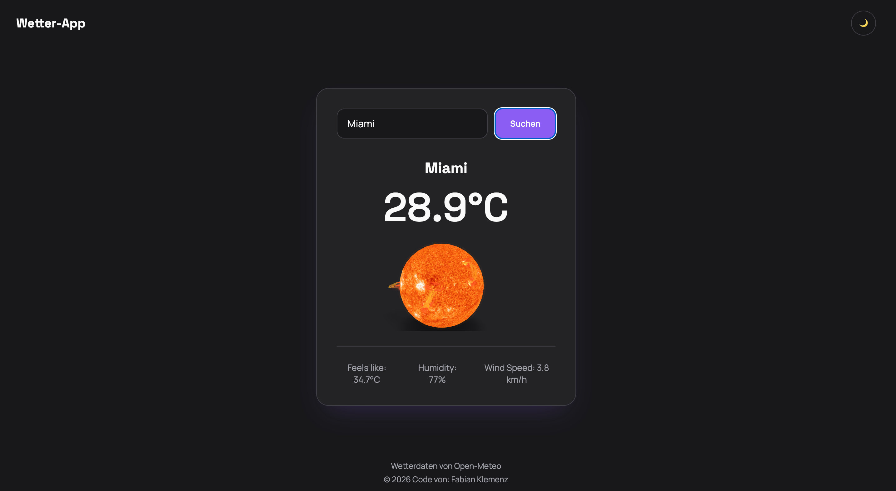

# Weather App

A weather app that fetches live data from the Open-Meteo API, built with vanilla JavaScript, HTML and CSS — featuring a light/dark mode toggle and animated 3D weather models.

## Features

- Search current weather by city name
- Live data via the [Open-Meteo](https://open-meteo.com/) API (geocoding + forecast)
- Temperature, feels-like, humidity and wind speed
- Interactive 3D weather models (sun, cloud, rain, snow, lightning) via [`<model-viewer>`](https://modelviewer.dev/)
- Light/dark mode toggle with `localStorage` persistence
- Error handling for city-not-found and network failures

## Tech Stack

- HTML, CSS, vanilla JavaScript (no frameworks)
- [Open-Meteo API](https://open-meteo.com/) — geocoding & weather data
- [`<model-viewer>`](https://modelviewer.dev/) — 3D model rendering
- Self-hosted fonts: Space Grotesk & Manrope

## Getting Started

1. Clone the repository
2. Open `index.html` with a local server (e.g. VS Code's Live Server extension)

No build step or dependencies required.

## 3D Model Credits

- "Sun and solar flares" by [Chaitanya Krishnan](https://sketchfab.com/chaitanyak) — Sketchfab Standard License
- "Cloud" by [RandyGF](https://sketchfab.com/RandyGF) — CC-BY-4.0
- "Is Just Rain" by [rhfqcntrkf](https://sketchfab.com/rhfqcntrkf) — CC-BY-4.0
- "falling snow loop" by [Elin](https://sketchfab.com/ElinHohler) — CC-BY-4.0
- "3 Pack of Storm Lightning" by [Incg5764](https://sketchfab.com/incg5764) — CC-BY-4.0

All models sourced from [Sketchfab](https://sketchfab.com).

## Author

Fabian Klemenz
